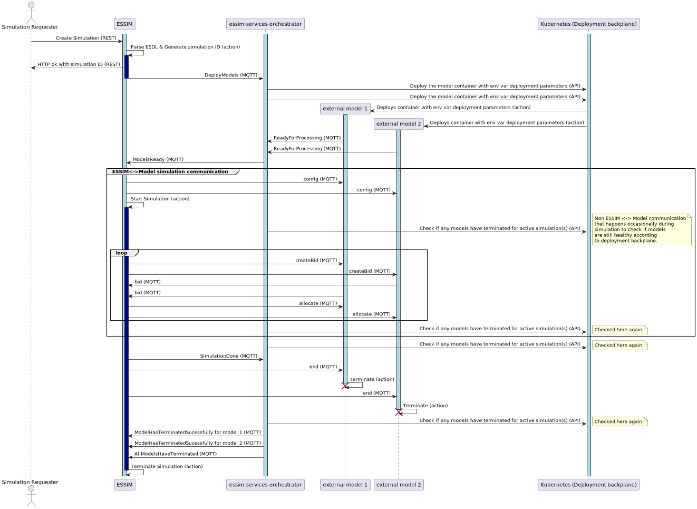

model-services-orchestrator a.k.a. Model Services Orchestrator (mso)

# Quickstart

Get a local cluster with a fake, mocked Simulation Orchestrator and the model-services-orchestrator running in 10
minutes with 4 fake, mocked external models.

Required:

- Python 3.9.*
- kind (https://kind.sigs.k8s.io/)
- kubectl (https://kubernetes.io/docs/tasks/tools/install-kubectl-linux/)
- docker
- docker-compose


❗ Ensure that the Docker Daemon is up and running before proceeding. The easiest way to do this is to start the Docker Desktop application.


### Start Kind cluster

To setup the development environment succesfully, use Ubuntu/WSL terminals with administrator privileges.

Open **Terminal 1** at the root folder of the repository:

```bash
ci/prepare_dev_env.sh # Prepare a virtualenv and install all dev-dependencies and dependencies.
cp .env.template .env # Copy the template for environment variables
cd ./simulation_components/ && ./setup_kind_cluster.sh # Setup a local kind cluster and upload the fake_model image to the kind image registry
```

This set of commands returns the `KUBERNETES_API_TOKEN`, `KUBERNETES_HOST` and `KUBERNETES_PORT` environment variables. Using a text editor, replace the contents of the `.env` file with the configuration below and manually copy the aforementioned 3 environment variables that `./setup_kind_cluster.sh` has returned inside this file as such:

```
KUBERNETES_API_TOKEN=<output from previous command>
KUBERNETES_HOST=<output from previous command>
KUBERNETES_PORT=<output from previous command>
KUBERNETES_PULL_IMAGE_SECRET_NAME=

MQTT_HOST=127.0.0.1
MQTT_PORT=1883
MQTT_USERNAME=dots
MQTT_PASSWORD=dotspass

SIMULATOR_NAME=dots-so
```

### Start Mosquitto and the MSO itself

Open **Terminal 2** at the root folder of the repository:

```bash
docker-compose --file ./docker-compose.local.yml up --build # Start MQTT broker mosquitto & model-services-orchestrator
```

### Run fake models

Back at **Terminal 1** still in `simulation_components/`:

```buildoutcfg
./run_fake_simulator_fake_model.sh # Run a mocked simulator that requests 4 models of fake_model type to be run.
```

### Output

In **Terminal 2** you should see log messages from `model-services-orchestrator`.

To explain some of them:

```
model-services-orchestrator_1  | 2022-07-08 11:33:50,082 [MainThread][model_inventory.py:43][INFO]: Adding models ['0-model', '1-model', '2-model', '3-model'] for simulation sim02-abc to inventory
model-services-orchestrator_1  | 2022-07-08 11:33:50,082 [MainThread][k8s_api.py:50][INFO]: Deploying pod 204-asd-sim02-abc-0-model
model-services-orchestrator_1  | 2022-07-08 11:33:50,083 [MainThread][k8s_api.py:59][DEBUG]: Not using pull image secret name.
model-services-orchestrator_1  | 2022-07-08 11:33:50,139 [MainThread][mqtt_application.py:111][INFO]: Successfully deployed model 0-model for simulation sim02-abc
model-services-orchestrator_1  | 2022-07-08 11:33:50,140 [MainThread][k8s_api.py:50][INFO]: Deploying pod 204-asd-sim02-abc-1-model
model-services-orchestrator_1  | 2022-07-08 11:33:50,142 [MainThread][k8s_api.py:59][DEBUG]: Not using pull image secret name.
model-services-orchestrator_1  | 2022-07-08 11:33:50,170 [MainThread][mqtt_application.py:111][INFO]: Successfully deployed model 1-model for simulation sim02-abc
model-services-orchestrator_1  | 2022-07-08 11:33:50,170 [MainThread][k8s_api.py:50][INFO]: Deploying pod 204-asd-sim02-abc-2-model
model-services-orchestrator_1  | 2022-07-08 11:33:50,171 [MainThread][k8s_api.py:59][DEBUG]: Not using pull image secret name.
model-services-orchestrator_1  | 2022-07-08 11:33:50,198 [MainThread][mqtt_application.py:111][INFO]: Successfully deployed model 2-model for simulation sim02-abc
model-services-orchestrator_1  | 2022-07-08 11:33:50,198 [MainThread][k8s_api.py:50][INFO]: Deploying pod 204-asd-sim02-abc-3-model
model-services-orchestrator_1  | 2022-07-08 11:33:50,200 [MainThread][k8s_api.py:59][DEBUG]: Not using pull image secret name.
model-services-orchestrator_1  | 2022-07-08 11:33:50,234 [MainThread][mqtt_application.py:111][INFO]: Successfully deployed model 3-model for simulation sim02-abc
```

model-services-orchestrator has received a request to deploy 4 external models. They are added to the 'inventory'
which is a list of all deployed external models in the memory of the model-services-orchestrator. They are also
deployed on the local kind kubernetes cluster.

```
model-services-orchestrator_1  | 2022-07-08 11:33:51,585 [MainThread][model_inventory.py:99][DEBUG]: Notifying state observers that model sim02-abc/0-model has changed state from ModelState.CREATED to ModelState.RUNNING
model-services-orchestrator_1  | 2022-07-08 11:33:51,605 [MainThread][model_inventory.py:99][DEBUG]: Notifying state observers that model sim02-abc/3-model has changed state from ModelState.CREATED to ModelState.RUNNING
model-services-orchestrator_1  | 2022-07-08 11:33:51,918 [MainThread][model_inventory.py:99][DEBUG]: Notifying state observers that model sim02-abc/2-model has changed state from ModelState.CREATED to ModelState.RUNNING
```

External models 0, 3 and 2 have let the model-services-orchestrator know that they have successfully started running.

```
model-services-orchestrator_1  | 2022-07-08 11:33:52,400 [MainThread][model_inventory.py:85][INFO]: Model sim02-abc/1-model now has exit code 1 due to: Error.
model-services-orchestrator_1  | 2022-07-08 11:33:52,400 [MainThread][poll_pod_health_application.py:48][INFO]: Model sim02-abc/1-model has terminated. Marking as ModelState.TERMINATED_FAILED.
model-services-orchestrator_1  | 2022-07-08 11:33:52,400 [MainThread][k8s_api.py:111][INFO]: Retrieving last log lines for pod 204-asd-sim02-abc-1-model
model-services-orchestrator_1  | 2022-07-08 11:33:52,591 [MainThread][poll_pod_health_application.py:56][WARNING]: Pod 204-asd.sim02-abc.1-model crashed with status 1 and the last 30 log lines are: 
model-services-orchestrator_1  | MQTT_HOST:      172.24.0.1
model-services-orchestrator_1  | MQTT_PORT:      1883
model-services-orchestrator_1  | MQTT_USERNAME:      172.24.0.1
model-services-orchestrator_1  | MQTT_PASSWORD:      <hidden>
model-services-orchestrator_1  | ESSIM_ID:       simulator01
model-services-orchestrator_1  | SIMULATION_ID:  sim02-abc
model-services-orchestrator_1  | MODEL_ID:       1-model
model-services-orchestrator_1  | EXIT_CODE:      1
model-services-orchestrator_1  | Model booting...
model-services-orchestrator_1  | Fake crashing before ReadyForProcessing with exit code 1
```

Unfortunately model 1 has crashed before it even transitioned from `CREATED` to `RUNNING`. It is marked as `TERMINATED`
and `FAILED` and the last 30 log lines of the external model are shown. We can see that our fake model was designed to
crash with exit code 1 before sending the ReadyForProcessing MQTT message to model-services-orchestrator.

```
model-services-orchestrator_1  | 2022-07-08 11:33:52,592 [MainThread][model_inventory.py:99][DEBUG]: Notifying state observers that model sim02-abc/1-model has changed state from ModelState.CREATED to ModelState.TERMINATED_FAILED
model-services-orchestrator_1  | 2022-07-08 11:33:52,592 [MainThread][model_state_observer.py:33][INFO]: Model sim02-abc/1-model exited with code (1) due to: Error
model-services-orchestrator_1  | 2022-07-08 11:33:52,593 [MainThread][mqtt_application.py:136][INFO]: Model sim02-abc/1-model has terminated. Send out ModelHasTerminated.
```

As model 1 crashed, model-services-orchestrator will send out a `ModelHasTerminated` to theSO. This message will include
that the model was terminated due to a failure denoting that the model failed. It is up to the SO
to decide if the whole simulation has therefore failed or that it shall proceed by doing nothing.

```
model-services-orchestrator_1  | 2022-07-08 11:33:52,594 [MainThread][model_inventory.py:85][INFO]: Model sim02-abc/2-model now has exit code 2 due to: Error.
model-services-orchestrator_1  | 2022-07-08 11:33:52,595 [MainThread][poll_pod_health_application.py:48][INFO]: Model sim02-abc/2-model has terminated. Marking as ModelState.TERMINATED_FAILED.
model-services-orchestrator_1  | 2022-07-08 11:33:52,595 [MainThread][k8s_api.py:111][INFO]: Retrieving last log lines for pod 204-asd-sim02-abc-2-model
model-services-orchestrator_1  | 2022-07-08 11:33:52,596 [MainThread][mqtt_application.py:94][DEBUG]: Received unknown message. [/lifecycle/mso/essim/sim02-abc/1-model/ModelHasTerminated] b'\x08\x01\x10\x01'
model-services-orchestrator_1  | 2022-07-08 11:33:52,606 [MainThread][poll_pod_health_application.py:56][WARNING]: Pod 204-asd.sim02-abc.2-model crashed with status 2 and the last 30 log lines are: 
model-services-orchestrator_1  | MQTT_HOST:      172.24.0.1
model-services-orchestrator_1  | MQTT_PORT:      1883
model-services-orchestrator_1  | MQTT_USERNAME:      172.24.0.1
model-services-orchestrator_1  | MQTT_PASSWORD:      <hidden>
model-services-orchestrator_1  | ESSIM_ID:       so01
model-services-orchestrator_1  | SIMULATION_ID:  sim02-abc
model-services-orchestrator_1  | MODEL_ID:       2-model
model-services-orchestrator_1  | EXIT_CODE:      2
model-services-orchestrator_1  | Model booting...
model-services-orchestrator_1  | ReadyForProcessing send.
model-services-orchestrator_1  | Fake crashing after ReadyForProcessing with exit code 2
model-services-orchestrator_1  | 
model-services-orchestrator_1  | 2022-07-08 11:33:52,606 [MainThread][model_inventory.py:99][DEBUG]: Notifying state observers that model sim02-abc/2-model has changed state from ModelState.RUNNING to ModelState.TERMINATED_FAILED
model-services-orchestrator_1  | 2022-07-08 11:33:52,607 [MainThread][model_state_observer.py:33][INFO]: Model sim02-abc/2-model exited with code (2) due to: Error
model-services-orchestrator_1  | 2022-07-08 11:33:52,607 [MainThread][mqtt_application.py:136][INFO]: Model sim02-abc/2-model has terminated. Send out ModelHasTerminated.
```

Similarly, model 2 has failed as well albeit after it transitioned to from `CREATED` to `RUNNING`. We can see that it
crashed with exit code 2 and that again a message `ModelHasTerminated` is send from model-services-orchestrator to
the SO.

```
model-services-orchestrator_1  | 2022-07-08 11:34:02,940 [MainThread][model_inventory.py:85][INFO]: Model sim02-abc/0-model now has exit code 0 due to: Success!.
model-services-orchestrator_1  | 2022-07-08 11:34:02,940 [MainThread][poll_pod_health_application.py:48][INFO]: Model sim02-abc/0-model has terminated. Marking as ModelState.TERMINATED_SUCCESSFULL.
model-services-orchestrator_1  | 2022-07-08 11:34:02,940 [MainThread][model_inventory.py:99][DEBUG]: Notifying state observers that model sim02-abc/0-model has changed state from ModelState.RUNNING to ModelState.TERMINATED_SUCCESSFULL
model-services-orchestrator_1  | 2022-07-08 11:34:02,941 [MainThread][mqtt_application.py:136][INFO]: Model sim02-abc/0-model has terminated. Send out ModelHasTerminated.
model-services-orchestrator_1  | 2022-07-08 11:34:02,942 [MainThread][model_inventory.py:85][INFO]: Model sim02-abc/3-model now has exit code 0 due to: Success!.
model-services-orchestrator_1  | 2022-07-08 11:34:02,942 [MainThread][poll_pod_health_application.py:48][INFO]: Model sim02-abc/3-model has terminated. Marking as ModelState.TERMINATED_SUCCESSFULL.
model-services-orchestrator_1  | 2022-07-08 11:34:02,942 [MainThread][model_inventory.py:99][DEBUG]: Notifying state observers that model sim02-abc/3-model has changed state from ModelState.RUNNING to ModelState.TERMINATED_SUCCESSFULL
model-services-orchestrator_1  | 2022-07-08 11:34:02,942 [MainThread][mqtt_application.py:136][INFO]: Model sim02-abc/3-model has terminated. Send out ModelHasTerminated.
```

Models 3 and 0 have run successfully and completed their process. They transition to `TERMINATED` and `SUCCESSFULL`.
SO is send a `ModelHasTerminated` detailing the success for both model 0 and 3 separately.

```
ssim-services-orchestrator_1  | 2022-07-08 11:34:02,943 [MainThread][mqtt_application.py:143][INFO]: All models for simulation sim02-abc have terminated. Send out AllModelsHaveTerminated.
model-services-orchestrator_1  | 2022-07-08 11:34:02,944 [MainThread][model_inventory.py:56][INFO]: Removing simulation sim02-abc from cache.
model-services-orchestrator_1  | 2022-07-08 11:34:03,964 [MainThread][poll_pod_health_application.py:65][INFO]: Model sim02-abc/0-model is unknown. Removing.
model-services-orchestrator_1  | 2022-07-08 11:34:03,964 [MainThread][k8s_api.py:92][INFO]: Deleting pod 204-asd-sim02-abc-0-model
model-services-orchestrator_1  | 2022-07-08 11:34:03,990 [MainThread][poll_pod_health_application.py:65][INFO]: Model sim02-abc/1-model is unknown. Removing.
model-services-orchestrator_1  | 2022-07-08 11:34:03,990 [MainThread][k8s_api.py:92][INFO]: Deleting pod 204-asd-sim02-abc-1-model
model-services-orchestrator_1  | 2022-07-08 11:34:04,009 [MainThread][poll_pod_health_application.py:65][INFO]: Model sim02-abc/2-model is unknown. Removing.
model-services-orchestrator_1  | 2022-07-08 11:34:04,009 [MainThread][k8s_api.py:92][INFO]: Deleting pod 204-asd-sim02-abc-2-model
model-services-orchestrator_1  | 2022-07-08 11:34:04,028 [MainThread][poll_pod_health_application.py:65][INFO]: Model sim02-abc/3-model is unknown. Removing.
model-services-orchestrator_1  | 2022-07-08 11:34:04,028 [MainThread][k8s_api.py:92][INFO]: Deleting pod 204-asd-sim02-abc-3-model
```

All models have terminated either successfully or erronuous. The simulation has therefore ended and a message
`AllModelsHaveTerminated` is send to the SO. The simulation is removed from the internal inventory of the
model-services-orchestrator and all external models are removed from the local kind k8s cluster.

The communication which is demonstrated is also documented in the following sequence diagram:
[](docs/design_sequence_diagram.png)

# What is model-services-orchestrator?

The model-services-orchestrator is a component made for a simulation architecture that is able to manage external
simulation models in a kubernetes (k8s) cluster. It receives messages through a message broker such as Mosquitto MQTT to
set up a number of models for a simulation, and it sends messages back to the SO in case a model breaks or successfully
terminated.


**MQTT Broker:** The component to transport messages between components using the publish/subscribe pattern with MQTT
messages. Mosquitto has been used in initial developments.

**Model:** An external model deployed on the k8s and is used by the SO in a simulation.

**Deployment backplane:** A cluster technology such as kubernetes (k8s). Currently, only k8s is supported.

**SO (Simulation Orchestrator):** Communicates with the model-services-orchestrator to manage the
external models while it will communicate with the external models for running the simulation.

**Model Services Orchestrator:** The model-services-orchestrator component.

The whole architecture is expected to run in the same cluster, albeit in different namespaces
(more on this at [Remote cluster](#Remote cluster).

## Files and directories

- **ci:** Contains a number of scripts to prepare and manage the development environment while also running tools
  in the development environment.
- **docs:** Contains a number of documentation artifacts such as pictures and sequence diagrams.
- **model_services_orchestrator:** Contains the python3 sources of the model-services-orchestrator.
- **java:** Contains the generated protobuf messages to be used by the SO for interaction with the
  model-services-orchestrator in the Java language.
- **k8s_cluster_configuration:** Contains the k8s configuration that the model-services-orchestrator expects in a remote
  or local cluster.
- **message_definitions:** The protobuf message definitions for managing the external models which are send between
  the SO and the model-services-orchestrator.
- **simulation_components:** A number of mocks and setup for local cluster to be used during development.
- **test:** The directory for unit tests. Currently empty as no unit tests were written (Please create tests...)
- **.dockerignore:** A file containing which files and directories to ignore when submitting this repo as a Docker
  build  
  context. In other words, it prevents the entries from being send to Docker when the Docker image is
  build.
- **.env.template:** A template .env file containing the environment variables model-services-orchestrator needs when
  executed.
- **.gitignore:** A file containing which files and directories not to add to the git repository.
- **.gitlab-ci.yml:** The steps executed by the Gitlab CI pipeline when a new commit is pushed to the git repository.
- **.pylintrc:** The configuration file for pylint which is the linter for this project.
- **dev-requirements.in:** The development Python dependencies.
- **dev-requirements.txt:** A pinned version of the development Python dependencies which is generated by
  `ci/update_dependencies.sh` and will be installed by `ci/prepare_dev_env.sh` in the local
  virtual environment.
- **docker-compose.local.yml:** Runs the model-services-orchestrator in Docker with a Mosquitto instance for development
  purposes by using the local code sources and configurations.
- **docker-compose.registry.yml:** Runs the model-services-orchestrator in Docker with a Mosquitto instance for
  development purposes by using the model-services-orchestrator image from the
  ci.tno.nl image registry.
- **Dockerfile:** The build file for the Docker image.
- **mypy.ini:** The configuration file for the mypy tool. mypy is used for static type hint analysis through the
  `ci/type_check.sh` command.
- **requirements.in:** The Python dependencies necessary to run model-services-orchestratur.
- **requirements.txt:** The pinned Python dependencies necessary to run model-services-orchestrator.
- **run_model_services_orchestrator.sh:** A quick shell script that runs the model-services-orchestrator locally as a
  Python program without any docker or k8s involved.
- **setup_remote_cluster.sh:** Shell script to deploy the k8s_cluster_configuration to some k8s cluster.
  See [Remote cluster](##Remote cluster) for more info.

# Setup

The model-services-orchestrator is meant to run in a cluster, either locally or remote, in conjection with the SO
and other components.

## Remote cluster

The model-services-orchestrator expects the k8s cluster to configured in a certain way. It expects an API token
to interact with k8s and it expects a namespace to deploy the models (==dots) in. Authorization should
also be handled so the model-services-orchestrator is allowed to spin up and destroy any containers in the
model namespace.

An example configuration may be found in `k8s_cluster_configuration/mso_cluster_setup.yaml`. This configuration
may be deployed by running the script `setup_remote_cluster.sh`. Be sure to set the path to your k8s config in the
env var `KUBECONFIG` in `setup_remote_cluster.sh` so kubectl knows which cluster to use.

NOTE: a local cluster may be preferred for development. This is explained below in the
[Dev Environment](#Dev Environment) section.

# Dev Environment & Running model-services-orchestrator in various ways

## Requirements

- Python 3.9.*
- protoc (https://github.com/protocolbuffers/protobuf/)
- kind (https://kind.sigs.k8s.io/)
- kubectl (https://kubernetes.io/docs/tasks/tools/install-kubectl-linux/)
- docker
- docker-compose

## Setup dev environment

Development is done using a virtual environment for dependency management. The following command
will setup an initial virtual environment.

```bash
ci/prepare_dev_env.sh
```

## Setup local cluster

Create & setup cluster the local kind cluster:

```bash
cd ./simulation_components/
./setup_kind_cluster.sh
```

Add cluster environment variables by setting the following in a .env file on the root of this repo:

```bash
KUBERNETES_API_TOKEN=<SOME TOKEN>
KUBERNETES_HOST=<SOME HOST>
KUBERNETES_PORT=<SOME PORT>
```

### Run model_services_orchestrator

Run the model_services_orchestrator as a pure Python process on this machine without Docker or k8s.

```bash
./run_model_services_orchestrator.sh
```

### Run components with docker compose using local images

You can use docker-compose to build model-services-orchestrator locally.
This will also start mosquitto.

```bash
docker-compose -f ./docker-compose.local.yml up --build
```

### Run components with docker compose using images from registry

You can use docker-compose to run model-services-orchestrator using the latest image available on the ci.tno.nl image
registry. This will also start mosquitto.

```bash
docker-compose -f ./docker-compose.registry.yml up
```

### Running fake SO to deploy fake external models.

Run fake_so:

```bash
cd ./simulation_components/
./run_fake_simulator_fake_model.sh
```

## Remove local cluster

```bash
kind delete cluster --name=kind
```

## Normal dev flow

```bash
ci/prepare_dev_env.sh
ci/build_protobuf_messages.sh
ci/lint.sh
ci/test_unit.sh
ci/type_check.sh
```

### Python dependencies update

Python dependencies are defined in `dev-requirements.in` and `requirements.in`.
`pip-compile` from `pip-tools` is used to compile the `*.in` files to pinned
`*.txt` files.

In case dev-requirements.in or requirements.in are changed, run:

```bash
ci/update_dependencies.sh
```

# Future proposed features

## Version the protobuf protocol

Currently the protocol is defined through protobuf message definitions in `message_definitions` but any changes
need to be implemented by both the SO and model-services-orchestrator. While the SO may just use the latest version
that the model-services-orchestrator supports, the model-services-orchestrator must be backwards compatible
so it also works with older versions of the protocol. The reasons for this:

- External models may not be actively developed after the initial release. Backwards compatibility ensures that models
  will be compatible for as long as possible.
- When a running architecture is updated, the model-services-orchestrator may be updated first in a rolling fashion
  so newer instances of model-services-orchestrator are still compatible with the older the SO version. After, the SO
  may be updated in its own pace. Through this system, a running architecture may be updated with no downtime.

All in all, this requires the protocol to be versioned. This will allows us to keep track which version of the SO
and model-services-orchestrator are able to speak which version of the protocol and so we can keep track which
version of the SO is compatible with which version of model-services-orchestrator.

## Introduce an external model configuration registry

Currently the SO is tasked with supplying the environment variables needed for an external model to run.
Certain information must come from the SO such as the SIMULATION_ID and MODEL_ID (which coincides with the ESDL node id)
.
Other information such as MQTT_HOST and MQTT_PORT may be introduced by both the SO or the model-services-orchestrator
including also model-specific parameters such as the square footage of a house in case of a house model that calculates
the heating demand. These latter parameters may even be the same for specific types of external models. Therefore,
an external model configuration registry may be introduced to capture all this information instead of repeating it
across various ESDL definitions.

The features envisioned:
external model configuration registry...

- must contain the model-specific parameters per model type.
- must contain the parameters per model type and per version.
- must contain the (docker) image url and secrets on how to retrieve the image from a given image registry.
- may contain a description per model.
- must accept new model configurations in an append-only fashion. Deleting older configurations should not be the common
  workflow although in operational setting it may rarely be required to delete an configuration.
- may allow model configurations to become deprecated.
- must allow a model configuration to be retrieved based on an identifier in the ESDL which contains the model type and
  version.

Architecture diagram:


## Introduce healthcheck system

To guarantee the validity of a simulation we must know if any external models stop functioning during the simulation.
Due to the sheer number of models, a single one might crash without the system knowing about it. Therefore, a
healthcheck system must be implemented to guarantee that all models, model-services-orchestrator and the SO were healthy
during the entire simulation. Details may be found in [docs/Design of scaling.pptx](docs/Design of scaling.pptx)
